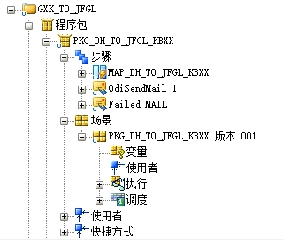
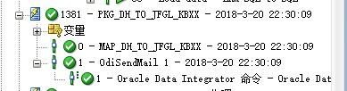
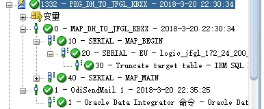

首先，见下图：

其中，`PKG_DH_TO_JFGL_KBXX`是程序包，而`PKG_DH_TO_JFGL_KBXX 版本001`则是一个场景。
操作中发现一个问题，即定期执行的场景并没有更新数据。
我分别手动运行了场景和程序包。
如下图，在操作器中：

`场景`执行情况如上，可见很快就完成了。

而`程序包`执行情况:

可见数据要多很多。

初步怀疑是因为场景生成的问题。准备测试下重新生成看看。

