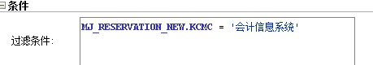

Title: ODI的过滤（ODI学习笔记3）
Date:
URL: 
Tags: 

在集成过程中会发现并非所有的数据都需要集成给目标，这时候就可以使用过滤（Filter）。

使用方法很简单，把`Filter`的图标拉到源和目标之间，再连线即可。

过滤条件可以点击`Filter`，点条件，点后面的齿轮。如下：

需注意的是，这里不需要写`select`或者`where`语句，直接写条件即可。