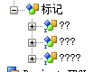

Title:ODI-15405错误
一个项目，运行正常，但是重新场景时报错：
```
java.lang.RuntimeException: java.lang.RuntimeException: oracle.odi.generation.OdiScenarioGeneratorException: ODI-15405: 场景生成异常错误: Failed to generate scenario.
	at oracle.odi.ui.framework.adapter.DefaultAdapter.executeBackgroundTask(DefaultAdapter.java:636)
	at oracle.odi.ui.framework.UIFramework.executeBackgroundTask(UIFramework.java:452)
	at com.sunopsis.graphical.scenario.DwgScenGeneratingWizard.generate(DwgScenGeneratingWizard.java:77)
	at oracle.odi.ui.action.SnpsPopupActionGenerateScenHandler.actionPerformed(SnpsPopupActionGenerateScenHandler.java:94)
	at oracle.odi.ui.SnpsActionControler.handleEvent(SnpsActionControler.java:94)
	at oracle.ide.controller.IdeAction$ControllerDelegatingController.handleEvent(IdeAction.java:1488)
	at oracle.ide.controller.IdeAction.performAction(IdeAction.java:663)
	at oracle.ide.controller.IdeAction.actionPerformedImpl(IdeAction.java:1159)
	at oracle.ide.controller.IdeAction.actionPerformed(IdeAction.java:618)
	at javax.swing.AbstractButton.fireActionPerformed(AbstractButton.java:2022)
	at javax.swing.AbstractButton$Handler.actionPerformed(AbstractButton.java:2348)
	at javax.swing.DefaultButtonModel.fireActionPerformed(DefaultButtonModel.java:402)
	at javax.swing.DefaultButtonModel.setPressed(DefaultButtonModel.java:259)
	at javax.swing.AbstractButton.doClick(AbstractButton.java:376)
	at javax.swing.plaf.basic.BasicMenuItemUI.doClick(BasicMenuItemUI.java:842)
	at javax.swing.plaf.basic.BasicMenuItemUI$Handler.mouseReleased(BasicMenuItemUI.java:886)
	at java.awt.Component.processMouseEvent(Component.java:6533)
	at javax.swing.JComponent.processMouseEvent(JComponent.java:3324)
	at java.awt.Component.processEvent(Component.java:6298)
	at java.awt.Container.processEvent(Container.java:2237)
	at java.awt.Component.dispatchEventImpl(Component.java:4889)
	at java.awt.Container.dispatchEventImpl(Container.java:2295)
	at java.awt.Component.dispatchEvent(Component.java:4711)
	at java.awt.LightweightDispatcher.retargetMouseEvent(Container.java:4889)
	at java.awt.LightweightDispatcher.processMouseEvent(Container.java:4526)
	at java.awt.LightweightDispatcher.dispatchEvent(Container.java:4467)
	at java.awt.Container.dispatchEventImpl(Container.java:2281)
	at java.awt.Window.dispatchEventImpl(Window.java:2746)
	at java.awt.Component.dispatchEvent(Component.java:4711)
	at java.awt.EventQueue.dispatchEventImpl(EventQueue.java:758)
	at java.awt.EventQueue.access$500(EventQueue.java:97)
	at java.awt.EventQueue$3.run(EventQueue.java:709)
	at java.awt.EventQueue$3.run(EventQueue.java:703)
	at java.security.AccessController.doPrivileged(Native Method)
	at java.security.ProtectionDomain$JavaSecurityAccessImpl.doIntersectionPrivilege(ProtectionDomain.java:80)
	at java.security.ProtectionDomain$JavaSecurityAccessImpl.doIntersectionPrivilege(ProtectionDomain.java:90)
	at java.awt.EventQueue$4.run(EventQueue.java:731)
	at java.awt.EventQueue$4.run(EventQueue.java:729)
	at java.security.AccessController.doPrivileged(Native Method)
	at java.security.ProtectionDomain$JavaSecurityAccessImpl.doIntersectionPrivilege(ProtectionDomain.java:80)
	at java.awt.EventQueue.dispatchEvent(EventQueue.java:728)
	at oracle.javatools.internal.ui.EventQueueWrapper._dispatchEvent(EventQueueWrapper.java:169)
	at oracle.javatools.internal.ui.EventQueueWrapper.dispatchEvent(EventQueueWrapper.java:151)
	at java.awt.EventDispatchThread.pumpOneEventForFilters(EventDispatchThread.java:201)
	at java.awt.EventDispatchThread.pumpEventsForFilter(EventDispatchThread.java:116)
	at java.awt.EventDispatchThread.pumpEventsForHierarchy(EventDispatchThread.java:105)
	at java.awt.EventDispatchThread.pumpEvents(EventDispatchThread.java:101)
	at java.awt.EventDispatchThread.pumpEvents(EventDispatchThread.java:93)
	at java.awt.EventDispatchThread.run(EventDispatchThread.java:82)
Caused by: java.lang.RuntimeException: oracle.odi.generation.OdiScenarioGeneratorException: ODI-15405: 场景生成异常错误: Failed to generate scenario.
	at com.sunopsis.graphical.scenario.DwgScenGeneratingWizard$1$1.doAction(DwgScenGeneratingWizard.java:104)
	at oracle.odi.core.persistence.dwgobject.DwgObjectTemplate.execute(DwgObjectTemplate.java:203)
	at oracle.odi.core.persistence.dwgobject.TransactionalDwgObjectTemplate.execute(TransactionalDwgObjectTemplate.java:64)
	at com.sunopsis.graphical.scenario.DwgScenGeneratingWizard$1.doInBackground(DwgScenGeneratingWizard.java:84)
	at com.sunopsis.graphical.scenario.DwgScenGeneratingWizard$1.doInBackground(DwgScenGeneratingWizard.java:78)
	at oracle.odi.ui.framework.AbsUIRunnableTask.run(AbsUIRunnableTask.java:258)
	at oracle.ide.dialogs.ProgressBar.run(ProgressBar.java:961)
	at java.lang.Thread.run(Thread.java:748)
Caused by: oracle.odi.generation.OdiScenarioGeneratorException: ODI-15405: 场景生成异常错误: Failed to generate scenario.
	at com.sunopsis.dwg.codeinterpretor.SnpGeneratorSQLCIT.treatPackageStep(SnpGeneratorSQLCIT.java:12118)
	at com.sunopsis.dwg.codeinterpretor.SnpGeneratorSQLCIT.mainGenPackageScenario(SnpGeneratorSQLCIT.java:3319)
	at com.sunopsis.dwg.codeinterpretor.SnpGeneratorSQLCIT.mainGenScenSourceScenario(SnpGeneratorSQLCIT.java:13308)
	at oracle.odi.generation.support.ScenarioUtils.generateNewScen(ScenarioUtils.java:358)
	at com.sunopsis.graphical.dialog.SnpsDialogScen.generateScen(SnpsDialogScen.java:218)
	at com.sunopsis.graphical.scenario.DwgScenGeneratingWizard.internalGenerate(DwgScenGeneratingWizard.java:161)
	at com.sunopsis.graphical.scenario.DwgScenGeneratingWizard.access$000(DwgScenGeneratingWizard.java:52)
	at com.sunopsis.graphical.scenario.DwgScenGeneratingWizard$1$1.doAction(DwgScenGeneratingWizard.java:100)
	... 7 more
```

一直没找到问题，最后解决办法是导出项目，重新导入，在新项目中生成即可。
怀疑是字符集的问题，因为导入的时候提示两个`标记组`的名字是乱码，同时打开新导入的副本，标记显示为乱码，如下：





时间有限，解决了就不再研究了。备忘。