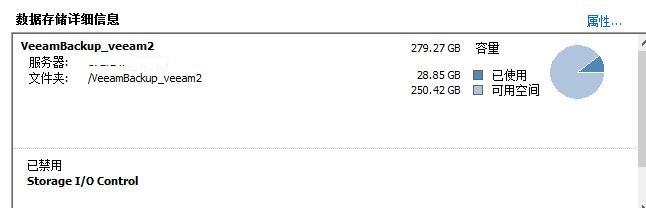
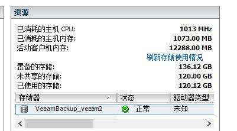

Veeam在Restore虚拟机的时候有两个常用选项：`Instant Recovery`和`Entire VM(Include registration)`，大致区别如下：

- Instant Recovery使用VEEAM备份服务器的空间作为存储，立刻在原主机上开启虚机。因此恢复非常快，十几秒就搞定了。当然由于使用的不是虚机存储，因此性能会有差距，适合非常着急恢复文件时使用。

- 在恢复时，也会提示你是否接入网络等选项。
- 而Entire VM则就是标准的VM恢复了，会恢复到虚机原有的存储中，适合正常的恢复。
- 需要注意的是Entire VM恢复的时候不能有重名的虚机在